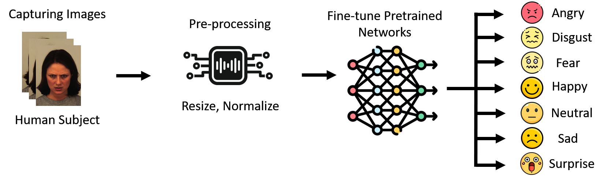

Training Summary:

    Epoch [1/50]  Train Loss: 1.1324 | Train Acc: 60.38%  || Val Loss: 0.4929 | Val Acc: 81.80%
    Saved new best model with val_acc: 81.80%
    Epoch [2/50]  Train Loss: 0.4077 | Train Acc: 87.49%  || Val Loss: 0.3704 | Val Acc: 87.41%
    Saved new best model with val_acc: 87.41%
    Epoch [3/50]  Train Loss: 0.2273 | Train Acc: 92.98%  || Val Loss: 0.2418 | Val Acc: 92.01%
    Saved new best model with val_acc: 92.01%
    Epoch [4/50]  Train Loss: 0.1222 | Train Acc: 96.89%  || Val Loss: 0.2428 | Val Acc: 92.01%
    Epoch [5/50]  Train Loss: 0.1046 | Train Acc: 97.06%  || Val Loss: 0.2372 | Val Acc: 91.67%
    Epoch [6/50]  Train Loss: 0.0743 | Train Acc: 98.13%  || Val Loss: 0.1703 | Val Acc: 94.39%
    Saved new best model with val_acc: 94.39%
    Epoch [7/50]  Train Loss: 0.0617 | Train Acc: 98.30%  || Val Loss: 0.3382 | Val Acc: 88.44%
    Epoch [8/50]  Train Loss: 0.0567 | Train Acc: 98.47%  || Val Loss: 0.1975 | Val Acc: 92.86%
    Epoch [9/50]  Train Loss: 0.0582 | Train Acc: 98.38%  || Val Loss: 0.2311 | Val Acc: 92.52%
    Epoch [10/50]  Train Loss: 0.0417 | Train Acc: 98.64%  || Val Loss: 0.2763 | Val Acc: 92.35%
    Epoch [11/50]  Train Loss: 0.0753 | Train Acc: 97.62%  || Val Loss: 0.2098 | Val Acc: 92.86%
    Epoch [12/50]  Train Loss: 0.0429 | Train Acc: 98.77%  || Val Loss: 0.2102 | Val Acc: 94.05%
    Epoch [13/50]  Train Loss: 0.0469 | Train Acc: 98.43%  || Val Loss: 0.2433 | Val Acc: 91.67%
    Epoch [14/50]  Train Loss: 0.0195 | Train Acc: 99.45%  || Val Loss: 0.2564 | Val Acc: 93.88%
    Epoch [15/50]  Train Loss: 0.0322 | Train Acc: 99.06%  || Val Loss: 0.2419 | Val Acc: 92.35%
    Epoch [16/50]  Train Loss: 0.0456 | Train Acc: 98.60%  || Val Loss: 0.2217 | Val Acc: 93.20%
    Epoch [17/50]  Train Loss: 0.0301 | Train Acc: 98.98%  || Val Loss: 0.2320 | Val Acc: 93.03%
    Epoch [18/50]  Train Loss: 0.0312 | Train Acc: 99.15%  || Val Loss: 0.1616 | Val Acc: 94.39%
    Epoch [19/50]  Train Loss: 0.0059 | Train Acc: 99.91%  || Val Loss: 0.1668 | Val Acc: 94.73%
    Saved new best model with val_acc: 94.73%
    Epoch [20/50]  Train Loss: 0.0031 | Train Acc: 99.96%  || Val Loss: 0.1425 | Val Acc: 95.58%
    Saved new best model with val_acc: 95.58%
    Epoch [21/50]  Train Loss: 0.0022 | Train Acc: 99.96%  || Val Loss: 0.1634 | Val Acc: 94.90%
    Epoch [22/50]  Train Loss: 0.0251 | Train Acc: 99.28%  || Val Loss: 0.2292 | Val Acc: 92.52%
    Epoch [23/50]  Train Loss: 0.0402 | Train Acc: 98.81%  || Val Loss: 0.2504 | Val Acc: 92.86%
    Epoch [24/50]  Train Loss: 0.0508 | Train Acc: 98.38%  || Val Loss: 0.1554 | Val Acc: 95.41%
    Epoch [25/50]  Train Loss: 0.0179 | Train Acc: 99.40%  || Val Loss: 0.2003 | Val Acc: 95.24%
    Epoch [26/50]  Train Loss: 0.0129 | Train Acc: 99.70%  || Val Loss: 0.1573 | Val Acc: 94.56%
    Epoch [27/50]  Train Loss: 0.0050 | Train Acc: 99.91%  || Val Loss: 0.1797 | Val Acc: 95.24%
    Epoch [28/50]  Train Loss: 0.0026 | Train Acc: 99.96%  || Val Loss: 0.1645 | Val Acc: 95.41%
    Epoch [29/50]  Train Loss: 0.0276 | Train Acc: 98.98%  || Val Loss: 0.3311 | Val Acc: 90.65%
    Epoch [30/50]  Train Loss: 0.0572 | Train Acc: 98.26%  || Val Loss: 0.2155 | Val Acc: 93.37%
    Epoch [31/50]  Train Loss: 0.0254 | Train Acc: 99.49%  || Val Loss: 0.2288 | Val Acc: 93.88%
    Epoch [32/50]  Train Loss: 0.0124 | Train Acc: 99.70%  || Val Loss: 0.2176 | Val Acc: 94.56%
    Epoch [33/50]  Train Loss: 0.0137 | Train Acc: 99.57%  || Val Loss: 0.2769 | Val Acc: 91.84%
    Epoch [34/50]  Train Loss: 0.0111 | Train Acc: 99.70%  || Val Loss: 0.2203 | Val Acc: 94.73%
    Epoch [35/50]  Train Loss: 0.0463 | Train Acc: 98.34%  || Val Loss: 0.2478 | Val Acc: 92.18%
    Epoch [36/50]  Train Loss: 0.0212 | Train Acc: 99.28%  || Val Loss: 0.2360 | Val Acc: 93.03%
    Epoch [37/50]  Train Loss: 0.0259 | Train Acc: 99.32%  || Val Loss: 0.2064 | Val Acc: 92.86%
    Epoch [38/50]  Train Loss: 0.0039 | Train Acc: 99.96%  || Val Loss: 0.1524 | Val Acc: 96.26%
    Saved new best model with val_acc: 96.26%
    Epoch [39/50]  Train Loss: 0.0053 | Train Acc: 99.87%  || Val Loss: 0.2094 | Val Acc: 95.58%
    Epoch [40/50]  Train Loss: 0.0265 | Train Acc: 99.23%  || Val Loss: 0.4456 | Val Acc: 88.27%
    Epoch [41/50]  Train Loss: 0.0172 | Train Acc: 99.53%  || Val Loss: 0.2251 | Val Acc: 94.22%
    Epoch [42/50]  Train Loss: 0.0023 | Train Acc: 99.96%  || Val Loss: 0.1783 | Val Acc: 95.24%
    Epoch [43/50]  Train Loss: 0.0017 | Train Acc: 99.96%  || Val Loss: 0.1831 | Val Acc: 95.58%
    Epoch [44/50]  Train Loss: 0.0016 | Train Acc: 99.96%  || Val Loss: 0.1795 | Val Acc: 96.09%
    Epoch [45/50]  Train Loss: 0.0046 | Train Acc: 99.79%  || Val Loss: 0.2901 | Val Acc: 92.86%
    Epoch [46/50]  Train Loss: 0.0731 | Train Acc: 97.70%  || Val Loss: 0.2256 | Val Acc: 94.05%
    Epoch [47/50]  Train Loss: 0.0118 | Train Acc: 99.66%  || Val Loss: 0.2706 | Val Acc: 93.88%
    Epoch [48/50]  Train Loss: 0.0114 | Train Acc: 99.74%  || Val Loss: 0.2619 | Val Acc: 93.71%
    Epoch [49/50]  Train Loss: 0.0169 | Train Acc: 99.66%  || Val Loss: 0.3609 | Val Acc: 93.20%
    Epoch [50/50]  Train Loss: 0.0147 | Train Acc: 99.57%  || Val Loss: 0.2783 | Val Acc: 93.71%

Obtained Results:

    Classification Report:

              precision    recall  f1-score   support

       Anger       0.99      0.92      0.95        84
     Disgust       1.00      0.95      0.98        84
        Fear       0.92      0.94      0.93        84
       Happy       0.98      0.99      0.98        84
     Neutral       0.97      0.99      0.98        84
         Sad       0.94      0.96      0.95        84
    Surprise       0.95      0.99      0.97        84

    accuracy                           0.96       588
    macro avg      0.96      0.96      0.96       588
    weighted avg   0.96      0.96      0.96       588

